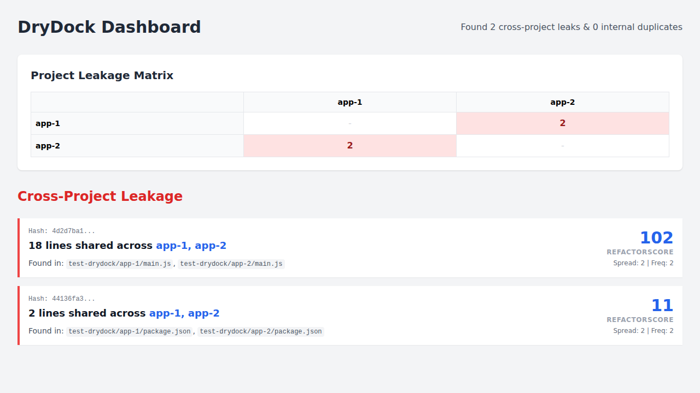
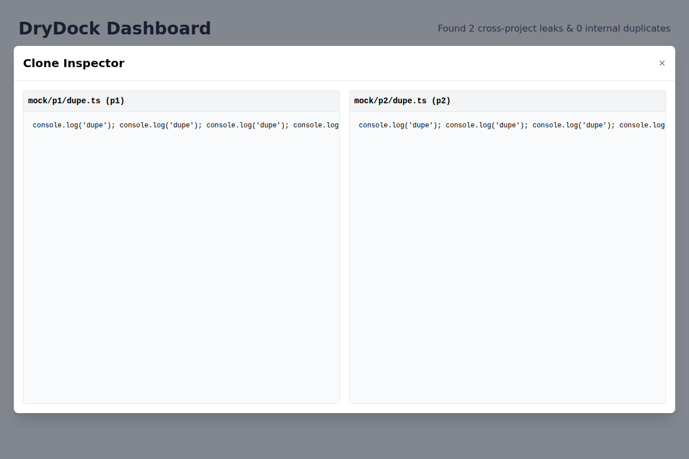

# DryDock

DryDock is a utility for detecting code duplication across repositories.

## Features

- **Cross-Project & Internal Duplication Detection:** Scans multiple directories to identify code duplicated across different projects vs. within the same project.
- **Smart Code Normalization:** Uses `@jscpd/tokenizer` to ignore whitespace, comments, and variable names, focusing on structural similarity.
- **RefactorScore Algorithm:** Prioritizes technical debt by calculating a score based on Spread (cross-project impact), Frequency, and Line count.
- **Interactive Dashboard:** A built-in web-based dashboard (port 3000) visualizing the "Leakage Matrix" and detailed clone lists.
- **Project Root Detection:** Automatically identifies project boundaries using `package.json`, `go.mod`, or `.git`.
- **CLI Support:** Simple command-line interface with file globbing and dashboard launch control (`--open`).
- **JSON Reporting:** Outputs detailed analysis to `drydock-report.json`.
- **Git Blame Integration:** Automatically fetches author and date information for duplicated code blocks if available.

## CLI Options

| Option | Description |
|--------|-------------|
| `--open` | Launch the interactive dashboard after scanning. |
| `--min-lines <n>` | Minimum number of lines for a block to be considered a duplicate (default: 0). |
| `--fail` | Exit with code 1 if cross-project leaks are detected (useful for CI/CD). |

## Configuration

You can create a `.drydockignore` file in the current directory to exclude specific files or directories from the scan. The format is similar to `.gitignore`.

Example `.drydockignore`:
```
src/generated/**
*.test.ts
```

## Verifying the Installation

To verify DryDock is correctly identifying cross-project leakage:

1. **Create a test folder:** `mkdir test-drydock && cd test-drydock`
2. **Setup mock projects:** - Create `app-1/main.js` and `app-2/main.js`.
   - Paste the same 50+ line function into both.
3. **Run the check:**
   ```bash
   drydock scan ./app-1 ./app-2 --open
   ```
4. **Validation:** You should see a "Cross-Project" badge in the dashboard with a high RefactorScore, indicating a "Library Candidate."

## Dashboard Results

Here is an example of the DryDock dashboard visualizing the cross-project leakage between two mock applications:



The dashboard highlights:
- A high **RefactorScore** for the duplicated `duplicate()` function.
- A **Leakage Matrix** showing the connection between `app-1` and `app-2`.

### Code Inspector

You can now inspect the duplicated code directly in the dashboard by clicking the "Inspect Code" button on any leakage item. This opens a side-by-side comparison of the normalized code occurrences.



## Roadmap: Next 20 Features

The following features are planned to further improve the utility:

1. [x] **Configurable Ignore Patterns:** Support `.drydockignore` to exclude specific files or directories.
2. [x] **Code Preview in Dashboard:** View the actual source code side-by-side for identified clones.
3. [x] **CI/CD Integration:** Add exit codes and failure thresholds for build pipeline integration.
4. [x] **Custom Thresholds:** Allow CLI flags to set minimum lines or token count for detection.
5. [x] **Git Blame Integration:** Show the author and commit date for duplicated code blocks.
6. **Export to Formats:** Support export to HTML (static), CSV, and JUnit XML.
7. **Historical Analysis:** Track duplication trends over time by comparing reports.
8. **Clone Diff View:** Visual highlight of differences (if any) in structural clones.
9. **Language Agnostic Extensions:** Easier plugin system for adding support for more languages.
10. **Parallel Processing:** Multi-threaded scanning for large repositories to improve performance.
11. **Interactive CLI Mode:** TUI (Text User Interface) for exploring results in the terminal.
12. **IDE Extensions:** Plugins for VS Code and IntelliJ to highlight duplicates in the editor.
13. **Dependency Analysis:** Flag duplicates that match known open-source libraries.
14. **Auto-Refactor Suggestions:** Generate boilerplate for extracting duplicates into a shared library.
15. **Graph Visualization:** Node-link diagram showing dependency relationships between projects based on leaks.
16. **Whitelisting:** Ability to mark specific duplicates as "accepted" or "false positive".
17. **Docker Support:** Official Docker image for easy deployment in containerized environments.
18. **REST API:** Expose the dashboard server as an API for external tools.
19. **Slack/Teams Notifications:** Webhooks to notify teams when new cross-project leaks are detected.
20. **Monorepo Support:** Specialized optimization and logic for massive monorepos (e.g., Lerna, Nx, Turborepo).
