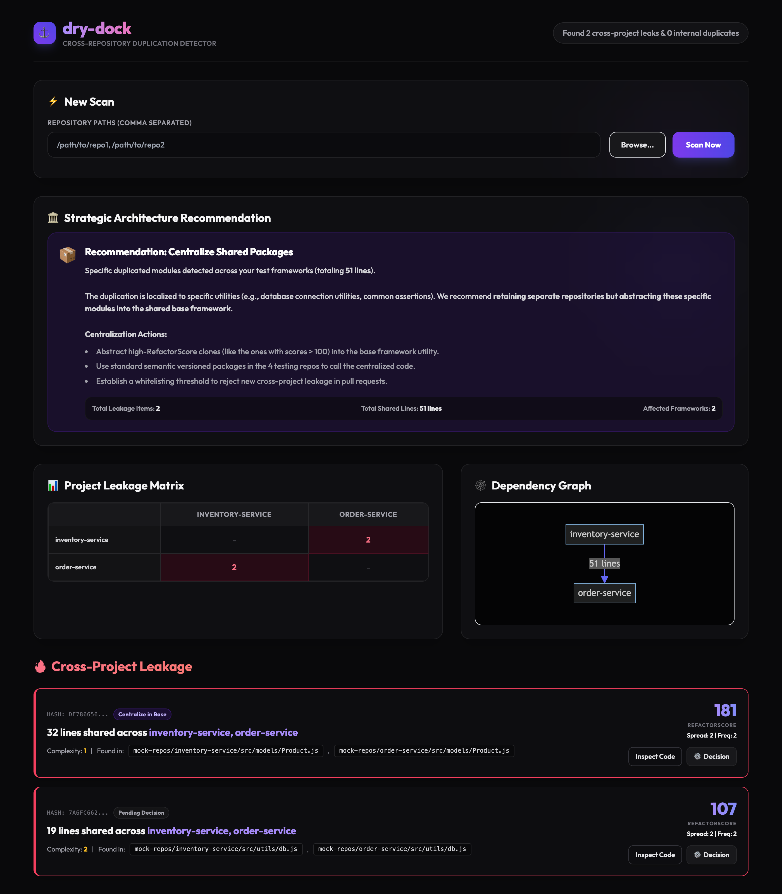
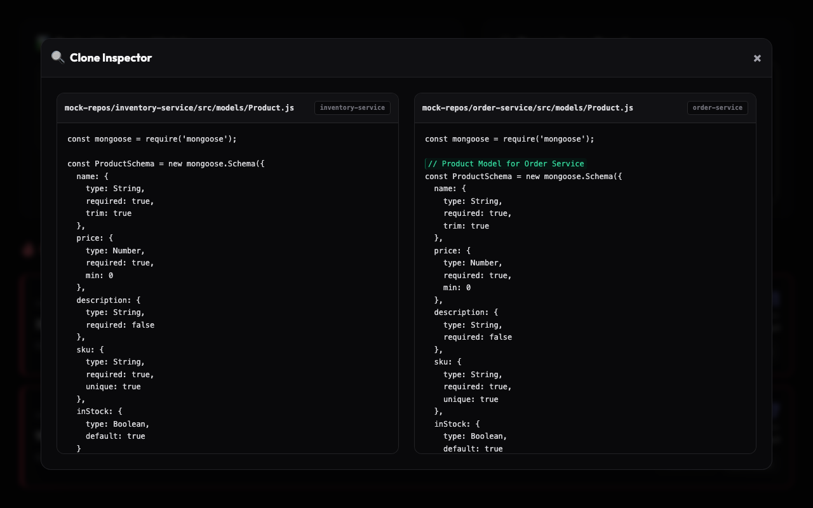

# dry-dock

dry-dock is a modern, static-analysis utility designed to detect structural code duplication and API leakage across independent repositories.

---

## 🏛️ Business Perspective: Why dry-dock?

In modern multi-repo and microservice architectures, **code duplication is a silent profit killer**. When multiple teams copy-paste utility functions, test configurations, database wrappers, or API models, the organization incurs substantial hidden costs:
1. **Maintenance Drag**: A bug fixed in one repository must be manually copied to others. If one is missed, it leads to production regressions.
2. **Quality & Test Drift**: Test automation suites (e.g., Playwright + Cucumber) drift out of sync, making quality assertions unreliable across different repositories.
3. **Tribal Knowledge Silos**: Teams build duplicate versions of the same features, wasting valuable engineering hours.

**dry-dock solves this** by scanning codebases, normalizing syntax (variable names, spaces, and comments are ignored to inspect the underlying structural logic), and outputting a prioritized **RefactorScore**. It gives engineering leaders the exact data needed to decide whether to **Centralize code into shared libraries** or **merge repositories into a Monorepo**.

---

## 👥 Who is this for?

| Role | How they use dry-dock | Business Benefit |
| :--- | :--- | :--- |
| **Quality Engineering (QE) / SDETs** | Find duplicate step definitions, selectors, and test helper functions across multiple Playwright/Cucumber test repositories. | Consolidation of test automation overhead, leading to **faster, more reliable test execution** and **unified quality gates**. |
| **Software Architects** | Audit structural "leakage" of business logic, DTOs, or database connectors across backend microservices. | Solidifies software boundaries, enables **faster architectural changes**, and ensures **easier API upgrades**. |
| **Engineering Managers / Directors** | Track refactoring progress over time via historical trend analyses and PDF export reports. | **Data-driven prioritization** of engineering sprints to tackle high-impact technical debt. |
| **DevOps / Platform Engineers** | Run dry-dock as a gated check in CI/CD pipelines (e.g., GitHub Actions, GitLab CI). | **Zero-accumulation policy** for new technical debt; blocks duplicate code from being merged in PRs. |

---

## 🚀 Key Use Cases & Realized Value

### 1. Merging Fractured Test Frameworks
* **Scenario**: Four different product teams have created identical test automation setups in Playwright, leading to duplicate config files and helper scripts.
* **dry-dock Action**: Runs a cross-repository scan and scores the overlap. It provides a visual **Dependency Graph** and automatically recommends whether to build a shared library or merge into a Monorepo.
* **Business Value**: Eliminates up to **40% of test maintenance hours** and ensures QA policies are applied uniformly.

### 2. Identifying Microservices "Logic Leakage"
* **Scenario**: Separate microservices copy-paste database schemas (e.g., Mongoose models) or DTO definitions to speed up development.
* **dry-dock Action**: Highlights the duplication in the **Leakage Matrix** and estimates the complexity of the cloned logic.
* **Business Value**: Ensures that schema changes or database security updates only need to be written and tested **once** in a centralized package, reducing release cycle times.

### 3. Automated PR Governance & CI Gates
* **Scenario**: Developers accidentally copy-paste large blocks of helper code instead of importing them.
* **dry-dock Action**: Integrated into the CI pipeline with the `--fail` flag. If duplicate code exceeding the threshold is committed, the build fails and posts a detailed report directly onto the Pull Request.
* **Business Value**: Prevents technical debt from entering the main codebase in real-time, preserving code quality **without manual code review overhead**.

---

## Features

- **Cross-Project & Internal Duplication Detection:** Scans multiple directories to identify code duplicated across different projects vs. within the same project.
- **Smart Code Normalization:** Uses `@jscpd/tokenizer` to ignore whitespace, comments, and variable names, focusing on structural similarity.
- **RefactorScore Algorithm:** Prioritizes technical debt by calculating a score based on Spread (cross-project impact), Frequency, and Line count.
- **Interactive Dashboard:** A built-in web-based dashboard (port 3000) visualizing the "Leakage Matrix" and detailed clone lists.
- **Project Root Detection:** Automatically identifies project boundaries using `package.json`, `go.mod`, or `.git`.
- **CLI Support:** Simple command-line interface with file globbing and dashboard launch control (`--open`).
- **JSON Reporting:** Outputs detailed analysis to `drydock-report.json`.
- **Git Blame Integration:** Automatically fetches author and date information for duplicated code blocks if available.

## Running Locally

To run the utility locally, you can use `npm start` or `npx ts-node`.

### Using npm start

The `npm start` command executes `ts-node src/drydock.ts`. You can pass arguments after `--`.

**Scan multiple directories:**

```bash
npm start -- scan /path/to/project-a /path/to/project-b
```

**Scan with dashboard (`--open`):**

```bash
npm start -- scan ./app-1 ./app-2 --open
```

**Scan with custom failure threshold:**

```bash
npm start -- scan ./monorepo/packages/* --fail
```

### Using npx ts-node

Alternatively, you can run the TypeScript file directly:

```bash
npx ts-node src/drydock.ts scan /path/to/project-a /path/to/project-b
```

### Using Docker

dry-dock provides an official Docker image to allow running without a local Node.js environment. To scan local repositories, simply mount them as a volume.

```bash
# Build the image locally
docker build -t dry-dock .

# Run a scan against mounted directories
docker run --rm -v "$(pwd)/my-projects:/scan-dir" dry-dock scan /scan-dir/service-a /scan-dir/service-b --formats json
```

### Path Examples

You can point to different project folder locations using relative or absolute paths:

- **Relative Paths:**
  ```bash
  npm start -- scan ./backend ./frontend
  ```

- **Absolute Paths:**
  ```bash
  npm start -- scan /Users/username/projects/service-a /Users/username/projects/service-b
  ```

- **Glob Patterns (handled by your shell):**
  ```bash
  npm start -- scan ../microservices/*
  ```

## CLI Options

| Option | Description |
|--------|-------------|
| `--open` | Launch the interactive dashboard after scanning. |
| `--min-lines <n>` | Minimum number of lines for a block to be considered a duplicate (default: 0). |
| `--fail` | Exit with code 1 if cross-project leaks are detected (useful for CI/CD). |
| `--formats <list>` | Comma-separated list of output formats: `json`, `csv`, `junit`, `html`, `pdf`, `mermaid` (default: `json`). |
| `--whitelist <file>` | Path to a file containing duplicate hashes to ignore (defaults to `.drydockwhitelist`). |
| `--compare <file>` | Path to a previous `drydock-report.json` to perform a trend analysis on new, resolved, and remaining leaks. |
| `--webhook <url>` | URL to send a JSON POST request with the scan summary (e.g., for Slack/Teams integration). |
| `--project-webhooks <file>` | Path to a JSON file containing a mapping of project names to webhook URLs to notify specific teams. |
| `--language <.ext=format>` | Dynamically register custom file extensions and their corresponding tokenizer formats (e.g., `--language .ex=elixir`). |
| `--api-only` | Starts the server in REST API mode with CORS headers without running an initial scan or opening the dashboard. |

## Configuration

You can create a `.drydockignore` file in the current directory to exclude specific files or directories from the scan. The format is similar to `.gitignore`.

You can also create a `.drydockwhitelist` file to tell dry-dock to ignore specific structural clones. This is useful for marking "accepted" duplicates or false positives. Add the hash of the duplicate (found in the JSON report or dashboard) on a new line. You can add comments starting with `#`.

Example `.drydockwhitelist`:
```
# Ignore this specific boilerplate class
085731f120ffe1ec0c734b60935777b44faeae20876226d79265f824fbc3a1b1
```

Example `.drydockignore`:
```
src/generated/**
*.test.ts
```

## Verifying the Installation

To verify dry-dock is correctly identifying cross-project leakage:

1. **Create a test folder:** `mkdir test-drydock && cd test-drydock`
2. **Setup mock projects:** - Create `app-1/main.js` and `app-2/main.js`.
   - Paste the same 50+ line function into both.
3. **Run the check:**
   ```bash
   drydock scan ./app-1 ./app-2 --open
   ```
4. **Validation:** You should see a "Cross-Project" badge in the dashboard with a high RefactorScore, indicating a "Library Candidate."

## Real World Example

To demonstrate dry-dock's capabilities in a more realistic scenario, let's consider two microservices: `inventory-service` and `order-service`. Both services are built with Node.js and Express, and they share some common code, such as database connection logic and data models.

1.  **Scenario Setup:**
    Run `./setup_real_world_example.sh` to generate the mock repositories.

    The script creates:
    - `inventory-service/src/models/Product.js`: A Mongoose model for products.
    - `order-service/src/models/Product.js`: Identical model file, duplicated.
    - `inventory-service/src/utils/db.js`: Database connection utility.
    - `order-service/src/utils/db.js`: Same logic, but with different comments and whitespace.

2.  **Running the Scan:**
    ```bash
    drydock scan mock-repos/inventory-service mock-repos/order-service --formats json
    ```

3.  **Outcome:**
    dry-dock successfully identifies both the exact match (`Product.js`) and the structural match (`db.js`), ignoring the differences in comments.

    *Snippet from `drydock-report.json`:*
    ```json
    {
      "cross_project_leakage": [
        {
          "lines": 32,
          "score": 181.01,
          "projects": ["inventory-service", "order-service"],
          "occurrences": [
            { "file": "mock-repos/inventory-service/src/models/Product.js" },
            { "file": "mock-repos/order-service/src/models/Product.js" }
          ]
        },
        {
          "lines": 19,
          "score": 107.48,
          "projects": ["inventory-service", "order-service"],
          "occurrences": [
            { "file": "mock-repos/inventory-service/src/utils/db.js" },
            { "file": "mock-repos/order-service/src/utils/db.js" }
          ]
        }
      ]
    }
    ```

## Dashboard Results

Here is an example of the dry-dock dashboard visualizing the cross-project leakage between two mock applications:



The dashboard highlights:
- A high **RefactorScore** for the duplicated `duplicate()` function.
- A **Leakage Matrix** showing the connection between `app-1` and `app-2`.

### Code Inspector

You can now inspect the duplicated code directly in the dashboard by clicking the "Inspect Code" button on any leakage item. This opens a side-by-side comparison of the normalized code occurrences.


